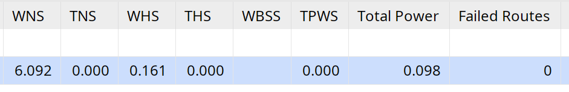
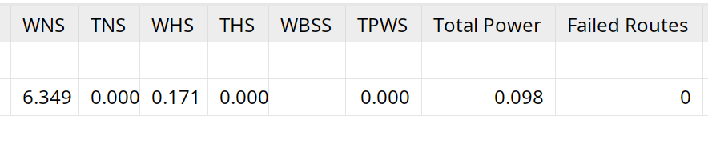

# UART Controller

This repository contains system verilog code for transmitting and receiving UART frames the following properties.
- 1 start bit
- 8-bit data width
- 1 stop bit
- No parity bit
- 115200 baud rate

The data width and baud rate can be customised by modifying the parameters in the modules in `rtl/`

## HDL Files

Folder `rtl/` contains the system verilog code
- `rtl/uart_tx` is code for the UART transmitter
- `rtl/uart_rx` is code for the UART receiver
- `rtl/axis_byte_source` is code to send data to `rtl/uart_tx` to transmit
- `rtl/axis_byte_sink` is code to receive data from `rtl/uart_rx`

All the above modules have an AXI-Stream interface.

The module `rtl/uart_loop` combines the above modules, connecting the TX line from `rtl/uart_tx` to the RX line of `rtl/uart_rx`.

The module `rtl/uart_top` also combines the above modules, but instead sends the TX line to an output port and receiving an RX line from an input port.

## Testbenches

Folder `tests/` contains testbenches written in python using the cocotb library.

In order to run the testbenches, open the project in an IDE of your choice and navigate to the tests directory in a terminal via `cd tests`.

Below are the commands for running each test benches.
```text
make tx         # Runs uart_tx_tb.py
make rx         # Runs uart_rx_tb.py
make loop       # Runs uart_loop_tb.py
make run_all    # Runs all of the above
```

## Vivado FPGA Implementation

The FPGA used is the Artix-7 Nexys A7 board with part number xc7a100tcsg324-1

Below is Vivado's timing analysis with a 100MHz clock input 

Where `rtl/uart_loop.sv` is the top level module:


Where `rtl/uart_top.sv` is the top level module:
